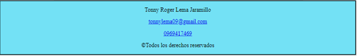
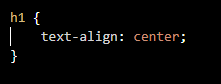

# Practica1_Mi_primer_sitio_web
<strong>Actividades Desarrolladas</strong>

•Una página principal denominada index.html 
En este HTML lo que se realizo es el diseño para la pagina principal del tema escogido

De esta manera se visualiza en la web la página principal denominada índex

•Ocho páginas en formato *.html secundarias con temas relacionados a la página principal.

Nota.- las páginas html, imágenes, audios, videos y otros recursos deberán estar organizadas en carpetas

•Todas las páginas deberán tener un menú de navegación el cuál, permite al usuario moverse de una manera clara y sencilla entre todas las páginas HTML, tanto la principal como las secundarias.
A continuación se representa como esta realizado el menú de navegación en HTML para  cada pagina

De esta manera es como se visualiza en la web

•Todas las páginas *.html deben estar estructuradas según la semántica de HTML5. Una estructura correcta de HTML5, sería:

•	Todas las páginas *.html deben tener una etiqueta header la cuál, deberá contener una imagen (logo) relacionada al tema elegido.
Código HTML que será realizado en cada una de la paginas

Logo ocupado para nuestra pagina web

•Todas las páginas *.html deben tener una etiqueta footer la cuál, deberá tener la información del estudiante como nombres completos, organización, correo (usar hipervínculo, mailto), teléfono (usar hipervínculo, tel), además deberá tener el símbolo de copyright junto a la leyenda de “Todos los derechos reservados”.
Etiqueta footer ocupa el cual contine correo electrónico , teléfono y el símbolo de Copyright todo esto realizado en HTML

Como se visualiza en la web nuestra etiqueta footer

•	Las páginas *.html deberán tener al menos dos etiquetas section, dos article y dos aside.
A continuación, se presenta en una de las páginas HTML ocupando los diferentes requisitos de igual manera de lo realizo en cada una de nuestra paginas

•	De igual manera, se pide que al menos una de las páginas dentro del contenido de la etiqueta article, tengan los siguientes requisitos:
1.	Una tabla con la siguiente estructura

Para lo cual se realizo de la siguiente manera en HTML

El resultado de como se muestra en la web

2.	Un video de YouTube (ver, etiqueta iframe).
Ocupando la etiqueta iframe en HTML nos quedade la siguiente manera

Resultado obtenido en la web

3.	Un video con la etiqueta video
Ocupando la etiqueta videos en HTML nos quedade la siguiente manera

Resultado obtenido en la web

4.	Un audio con la etiqueta audio.
Ocupando la etiqueta audio en HTML nos quedade la siguiente manera

Resultado obtenido en la web

5.	Manejar listas ordenadas o desordenadas con al menos cinco ítems
Se ocupo la lista ordena de forma numérica y nos quedó de la siguiente manera en HTML

Resultado obtenido en la web

6.	Tener al menos cinco etiquetas de texto que se encuentran en la figura 1-16 del texto guía de la asignatura
Para esto las etiquetas que se ocuparon son las siguientes:
. - abbr
. - em
. - time
. – span
. - Strong
•	Asimismo, se pide que todos los artículos article tengan al menos una imagen cada uno.
A continuación, se muestra como cada article cuenta con una imagen de tal manera se tenia que ocupar las rutas relativas ya que se encuentra dentro de otra carpeta las imágenes 

•	Finalmente, se pide que una de las páginas tenga al menos cuatro secciones (section) con tres artículos (article) cada sección
En donde se realizo este punto fue en el HTML llamado casas el cual se cumple con lo pedido como se muestra a continuación

Luego, cada sección debe tener un encabezado (header), en donde, se ubicarán enlaces que permitan navegar entre los artículos usando id’s
En esta imagen se puede observar la navegación utilizando id’s

Para lo cual dentro de casa sección tiene cada header el cual nos permitirá la navegación por id’s

Diseño CSS
Se pide utilizar, en al menos una página HTML, un diseño a dos columnas con cabecera y pie de página

Como se realizó el diseño en css

Como se muestra en la web

Así, como también se recomienda utilizar, en al menos una página HTML, un diseño a tres columnas con cabecera y pie de página

Como se realizó el diseño en css

Como se muestra en la web

De igual manera, se pide que se organice en al menos cuatro archivos CSS los estilos para las diferentes páginas html, estos archivos estarán almacenados en una carpeta llamada css

Un archivo será para el diseño a dos columnas, otro archivo para el diseño a tres columnas, otro archivo para el diseño de la página home, Por último, un archivo para la reglas CSS relacionas a textos, colores, tablas, secciones, artículos, imágenes, etc.

También, se pide que se utilice selectores por etiquetas, selectores descendentes, selectores por clase y selectores por id.
Selectores por etiquetas

Selectores descendentes

Selectores por clase

Selectores por id

Luego, se pide que se personalicen estilos referentes a texto tanto en color, tamaño, fuente, decoraciones, etc.

Se pide que se personalice todos los hipervínculos usando pseudo-clases.
Como se realizó el diseño en css

Resultado en la Web

También, se pide que se cree un menú horizontal (navegación) para todas las páginas
Como se realizó el diseño en css

Como se muestra en la web

crear una nueva página HTML, en donde, se muestre un formulario de contacto o crear cuenta que tenga campos como: nombre, mensaje y botón para enviar.
Código ocupado en HTML para la realización del formulario

Resultado en la Web

Conclusiones
•	Mediante la utilización de HTML y css se pudo ver de otra forma de cómo se realiza una página web en la en las que se utilizó el section, article o fooder que es una parte fundamental para el diseño de la página web.
•	Gracias a la utilización de GitHub se tubo otro tipo de respaldo ya sea para los HTML o css que en caso de que se elimine la carpeta nos queda como un respaldo adicional.
•	La utilización del diseño de los HTML ya sea de dos o de tres columnas no ayudo a mejorar me manera mas correcta el estar utilizando los márgenes de texto que nos permitió el mejor diseño de los HTML
Información de GitHub
Usuario: Tonny07Lema
URL del repositorio de la práctica:
https://github.com/Tonny07Lema/Practica1_Mi_primer_sitio_web
Firma de estudiante: 

